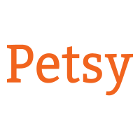

<!--
*** Thanks for checking out the Best-README-Template. If you have a suggestion
*** that would make this better, please fork the repo and create a pull request
*** or simply open an issue with the tag "enhancement".
*** Thanks again! Now go create something AMAZING! :D
***
***
***
*** To avoid retyping too much info. Do a search and replace for the following:
*** github_username, buttery, twitter_handle, email, project_title, project_description
-->

<!-- PROJECT SHIELDS -->
<!--
*** I'm using markdown "reference style" links for readability.
*** Reference links are enclosed in brackets [ ] instead of parentheses ( ).
*** See the bottom of this document for the declaration of the reference variables
*** for contributors-url, forks-url, etc. This is an optional, concise syntax you may use.
*** https://www.markdownguide.org/basic-syntax/#reference-style-links
-->
<!-- [![Contributors][contributors-shield]][contributors-url] -->
<!-- [![Forks][forks-shield]][forks-url] -->

<!-- [![Stargazers][stars-shield]][stars-url] -->
<!-- [![Issues][issues-shield]][issues-url] -->
<!-- [![MIT License][license-shield]][license-url] -->
<!-- [![LinkedIn][linkedin-shield]][linkedin-url] -->

<!-- PROJECT LOGO -->

<!-- <br /> -->
<p align="center">
  <a href="https://github.com/michael-gann/Petsy">
    
  </a>

  <h3 align="center">Petsy</h3>

  <p align="center">
    Petsy is a marketplace for pets and their owners, or those looking to add another member to their family! Petsy also offers items for all your pet needs.
    <br />
    <!-- <a href="https://github.com/michael-gann/buttery"><strong>Explore the docs »</strong></a> -->
    <br />
    <br />
    <a href="https://petsy-g5.herokuapp.com/">View Live Project</a>
    <!-- · -->
    <!-- <a href="https://github.com/michael-gann/buttery/issues">Report Bug</a> -->
    <!-- · -->
    <!-- <a href="https://github.com/michael-gann/buttery/issues">Request Feature</a> -->
  </p>
</p>

<!-- TABLE OF CONTENTS -->
<details open="open">
  <summary><h2 style="display: inline-block">Table of Contents</h2></summary>
  <ol>
    <li>
      <a href="#about-the-project">About The Project</a>
      <ul>
        <li><a href="#built-with">Built With</a></li>
      </ul>
    </li>
    <li>
      <a href="#getting-started">Getting Started</a>
      <ul>
        <li><a href="#prerequisites">Prerequisites</a></li>
        <li><a href="#installation">Installation</a></li>
      </ul>
    </li>
    <li><a href="#usage">Usage</a></li>
    <li><a href="#roadmap">Roadmap</a></li>
    <li><a href="#contributing">Contributing</a></li>
    <li><a href="#contact">Contact</a></li>
    <li><a href="#acknowledgements">Acknowledgements</a></li>
  </ol>
</details>

<!-- ABOUT THE PROJECT -->
## About The Project

<p align="center">
  
</p>

<!--  -->

### Built With

* [React](https://reactjs.org/)
* [Redux](https://redux.js.org/)
* [Flask](https://flask.palletsprojects.com/en/1.1.x/)

<!-- GETTING STARTED -->
## Getting Started

To start using the app, create an account to get started!

<!-- ### Prerequisites

* npm

  ```sh
  npm install npm@latest -g
  ```

### Installation

1. Clone the repo

   ```sh
   git clone https://github.com/michael-gann/buttery.git
   ```

2. Install NPM packages

   ```sh
   npm install
   ```

3. Change directory to app and install backend packages using pip

  ```sh
  pip install
  ``` -->

<!-- USAGE EXAMPLES -->
## Usage

### Product Listing

<!-- <p align="center">
  
</p> -->

Users who have an account can browse items to purchase. Petsy offers both pets from reputable owners and useful or fun items for your pet!

### Shopping Cart

<!-- <p align="center">
  
</p> -->

Users can add items to their cart that they are interested in purchasing or want to save to purchase later. This way they can keep track of items and have a quick reference to them and continue browsing.

### Comments/Reviews

<!-- <p align="center">
  
</p> -->

Users can see and leave reviews for items they want to or have purchased. Users can also rate an item between 1 and 5 stars to give other users an idea of the quality of the item they are looking at.

## DB Schema

<p align="center">

</p>

<!-- ROADMAP -->
## Roadmap

See the [open issues](https://github.com/michael-gann/Petsy/issues) for a list of proposed features (and known issues).

<!-- CONTRIBUTING -->
<!-- ## Contributing

Contributions are what make the open source community such an amazing place to be for learning, inspiring, and creating. Any contributions you make are **greatly appreciated**.

1. Fork the Project
2. Create your Feature Branch (`git checkout -b feature/AmazingFeature`)
3. Commit your Changes (`git commit -m 'Add some AmazingFeature'`)
4. Push to the Branch (`git push origin feature/AmazingFeature`)
5. Open a Pull Request -->

<!-- LICENSE -->
<!-- CONTACT -->
## Contact

### Nick Matthews

### Nick Matthews

- [Portfolio](https://www.nickfmatthews.com/)
- [LinkedIn](https://www.linkedin.com/in/nickfmatthews/)
- nickfmatthews@gmail.com

### Ryan Young

- [Portfolio](https://ryan-young.herokuapp.com/)
- [LinkedIn](https://www.linkedin.com/in/ryan-young-b67a7aab/)
- ryoung7986@gmail.com

### Michael Gann

- [Portfolio](https://michael-gann.github.io/michael-gann.github.io/)
- [LinkedIn](https://www.linkedin.com/in/michael-gann-1a2161201/)
- mchlgnn@protonmail.com

### Danny Pong

<!-- [Portfolio](https://michael-gann.github.io/michael-gann.github.io/)

[LinkedIn](https://www.linkedin.com/in/michael-gann-1a2161201/) -->

<!-- ACKNOWLEDGEMENTS -->

## Acknowledgements

* [othneildrew/best-README-template](https://github.com/othneildrew/Best-README-Template)
* [better-react-spinkit](https://www.npmjs.com/package/better-react-spinkit)
* [react-promise-tracker](https://www.npmjs.com/package/react-promise-tracker)

<!-- MARKDOWN LINKS & IMAGES -->
<!-- https://www.markdownguide.org/basic-syntax/#reference-style-links -->
[contributors-shield]: https://img.shields.io/github/contributors/michael-gann/repo.svg?style=for-the-badge
[contributors-url]: https://github.com/michael-gann/buttery/graphs/contributors
[forks-shield]: https://img.shields.io/github/forks/michael-gann/repo.svg?style=for-the-badge
[forks-url]: https://github.com/michael-gann/repo/network/members
[stars-shield]: https://img.shields.io/github/stars/michael-gann/buttery.svg?style=for-the-badge
[stars-url]: https://github.com/michael-gann/buttery/stargazers
[issues-shield]: https://img.shields.io/github/issues/michael-gann/repo.svg?style=for-the-badge
[issues-url]: https://github.com/michael-gann/buttery/issues
[license-shield]: https://img.shields.io/github/license/michael-gann/repo.svg?style=for-the-badge
[license-url]: https://github.com/michael-gann/repo/blob/master/LICENSE.txt
[linkedin-shield]: https://img.shields.io/badge/-LinkedIn-black.svg?style=for-the-badge&logo=linkedin&colorB=555
[linkedin-url]: https://www.linkedin.com/in/michael-gann-1a2161201/
[react-url]: https://img.shields.io/badge/react
